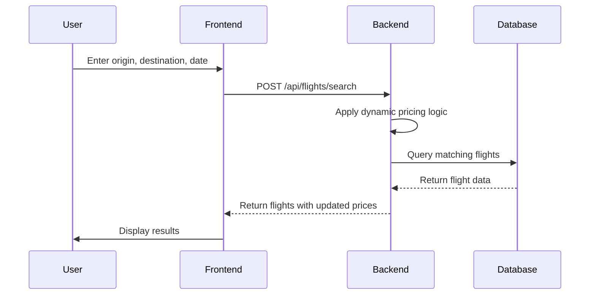
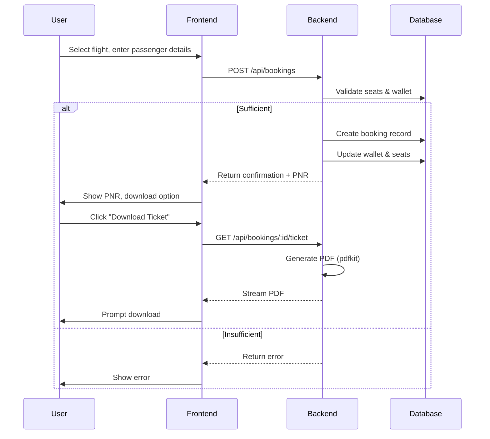

# Let's Go Sky - Flight Booking Website

<div align="center">


*Seamlessly search, book, and manage your flights with Let's Go Sky.*

<div align="center">
  <a href="https://nextjs.org/">
    
  </a>
  <a href="https://reactjs.org/">
    
  </a>
  <a href="https://tailwindcss.com/">
    
  </a>
  <a href="https://nodejs.org/">
    
  </a>
  <a href="https://expressjs.com/">
    
  </a>
  <a href="https://www.mongodb.com/">
    
  </a>
  <a href="https://www.typescriptlang.org/">
    
  </a>
  <a href="https://jwt.io/">
    
  </a>
  <a href="https://www.apache.org/licenses/LICENSE-2.0">
    
  </a>
</div>

</div>

## 🚀 Live Demo

**📱 Frontend:** [https://lets-go-sky.vercel.app/](https://lets-go-sky.vercel.app/)  
**⚙️ Backend API:** [https://lets-go-sky.onrender.com/api](https://lets-go-sky.onrender.com/api)

---

## 📋 Overview

Let's Go Sky is a full-stack flight-booking platform built with Next.js on the front end and Node.js/Express on the back end. It offers:

- **Intuitive flight search** (origin, destination, date)  
- **Dynamic pricing engine** that adapts based on user interactions  
- **Seamless booking flow** with PDF e-ticket generation  
- **Built-in user wallet** for quick, hassle-free payments  
- **Secure JWT authentication** and robust booking management  

Our goal: deliver a sleek, responsive UX backed by scalable, maintainable architecture.

---

## ✨ Key Features

- ### Intelligent Flight Search  
  - Airport auto-suggest from external APIs (e.g., AirLabs)  
  - Filter by date, time, price, stops  

- ### Dynamic Pricing Engine  
  - Price increase of 10% after 3 views in 5 minutes  
  - Automatic price reset after 10 minutes  

- ### Seamless Booking & E-Tickets  
  - Book for one or multiple passengers  
  - Instant PDF ticket generation via **pdfkit**  

- ### Integrated Wallet  
  - Default starting balance (e.g., ₹50,000)  
  - Deducted automatically at booking time  

- ### Secure Authentication  
  - JWT-based registration and login  
  - Password hashing with **bcryptjs**  

- ### Booking Management  
  - View upcoming, past, and cancelled bookings  
  - Cancel flights and refund to wallet  

- ### Responsive UI & Animations  
  - Next.js App Router + Tailwind CSS  
  - Framer Motion for smooth transitions  

---

## 💻 Tech Stack

| Layer             | Technologies & Libraries                                 |
| ----------------- | --------------------------------------------------------- |
| **Frontend**      | Next.js, React, TypeScript, Tailwind CSS, Axios          |
| **Animations**    | Framer Motion, React Icons                               |
| **Backend**       | Node.js, Express.js, JavaScript (TypeScript optional)    |
| **Database**      | MongoDB with Mongoose ORM                                |
| **Auth & Security** | JSON Web Tokens (JWT), bcryptjs                          |
| **PDF Generation** | pdfkit                                                  |
| **APIs**          | External Airport Data (AirLabs)                          |
| **Deployment**    | Backend on Render.com; Frontend on Vercel (recommended)  |

---

## 🏗️ Architecture

## 🏗️ Architecture

```
┌─────────────────────────────────┐      ┌─────────────────────────────────┐
│                                 │      │                                 │
│        Next.js Frontend         │      │       Node.js Backend           │
│                                 │      │                                 │
├─────────────────────────────────┤      ├─────────────────────────────────┤
│ ┌─────────────┐ ┌─────────────┐ │      │ ┌─────────────┐ ┌─────────────┐ │
│ │   UI Layer  │ │ State Mgmt  │ │      │ │ API Routes  │ │ PDF Service │ │
│ └─────────────┘ └─────────────┘ │◄────►│ └─────────────┘ └─────────────┘ │
│ ┌─────────────┐ ┌─────────────┐ │      │ ┌─────────────┐ ┌─────────────┐ │
│ │Search Forms │ │Booking Flow │ │      │ │Dynamic Price│ │Data Service │ │
│ └─────────────┘ └─────────────┘ │      │ └─────────────┘ └─────────────┘ │
│                                 │      │                                 │
└─────────────────────────────────┘      └──────────────┬──────────────────┘
                                                        │
                                                        ▼
                                         ┌─────────────────────────────────┐
                                         │                                 │
                                         │        MongoDB Database         │
                                         │                                 │
                                         └──────────────┬──────────────────┘
                                                        │
                                                        ▼
                                         ┌─────────────────────────────────┐
                                         │                                 │
                                         │     AirLabs External API        │
                                         │                                 │
                                         └─────────────────────────────────┘
```

<div align="center">
  <em>High-level data flow between user, frontend, backend, and external services.</em>
</div>

---

## 🔄 Core Workflows

### 1. Flight Search & Pricing



### 2. Booking & Ticket Generation



---

## 🚀 Local Development

### Prerequisites

* Node.js v18+ & npm v8+
* MongoDB (local or Atlas)
* Git

### Backend Setup

1. Clone & enter `server/`
2. Install dependencies

   ```bash
   npm install
   ```
3. Create `.env`:

   ```env
   PORT=5000
   MONGODB_URI=<your_mongo_uri>
   JWT_SECRET=<your_jwt_secret>
   NODE_ENV=development
   ```
4. (Optional) Seed data: `npm run data:import`
5. Start server: `npm run dev`

### Frontend Setup

1. Enter `client/`
2. Install deps: `npm install`
3. Create `.env.local`:

   ```env
   NEXT_PUBLIC_API_URL=http://localhost:5000/api
   ```
4. Start dev server: `npm run dev`
5. Visit `http://localhost:3000`

---

## 📝 API Endpoints

| Method | Path                   | Description                 | Auth Required    |
| ------ | ---------------------- | --------------------------- | ---------------- |
| POST   | `/users/register`      | Register new user           | No               |
| POST   | `/users/login`         | Authenticate & retrieve JWT | No               |
| GET    | `/users/profile`       | Get user profile            | Yes              |
| GET    | `/users/wallet`        | Get wallet balance          | Yes              |
| POST   | `/flights/search`      | Search available flights    | No (opt. userId) |
| GET    | `/flights/:id`         | Get flight details          | No (opt. userId) |
| POST   | `/bookings`            | Create a new booking        | Yes              |
| GET    | `/bookings`            | List user's bookings        | Yes              |
| GET    | `/bookings/:id`        | Get booking details         | Yes              |
| PUT    | `/bookings/:id/cancel` | Cancel a booking            | Yes              |
| GET    | `/bookings/:id/ticket` | Download e-ticket PDF       | Yes              |

---

## 🖼️ Screenshots

<table align="center">
  <tr>
    <td align="center">
      <br>
      Welcome Page
    </td>
    <td align="center">
      <br>
      Login Page
    </td>
  </tr>
  <tr>
    <td align="center">
      <br>
      Home Page
    </td>
    <td align="center">
      <br>
      Search Page
    </td>
  </tr>
  <tr>
    <td align="center">
      <br>
      Booking Modal
    </td>
    <td align="center">
      <br>
      Confirm Page
    </td>
  </tr>
  <tr>
    <td align="center">
      <br>
      e-Ticket PDF
    </td>
    <td align="center">
      <br>
      My Bookings Page
    </td>
  </tr>
</table>


---

## 🚀 Future Enhancements

* User profile editing & avatars
* Advanced flight filters (airline, stops, duration)
* Interactive seat selection
* Wallet top-up via payment gateway
* Admin dashboard & analytics
* Email notifications & reminders
* "Forgot Password" flow
* Real-time flight status integration
* Internationalization (i18n)

---

## 🤝 Contributing

1. Fork the repo
2. Create feature branch: `git checkout -b feature/YourFeature`
3. Commit changes: `git commit -m "Add feature"`
4. Push branch: `git push origin feature/YourFeature`
5. Open a pull request

We welcome issues and pull requests! Please follow the existing code style and include tests where appropriate.

---

## 📄 License

This project is licensed under the **Apache License 2.0**.
See the full text in [LICENSE](LICENSE).

---

<p align="center">
  Built with ❤️ by Samarth Bansal  
  <br/>
  <a href="[https://github.com/bansal-samarth]">GitHub</a> • <a href="[https://www.linkedin.com/in/samarth--bansal/]">LinkedIn</a>
</p>
